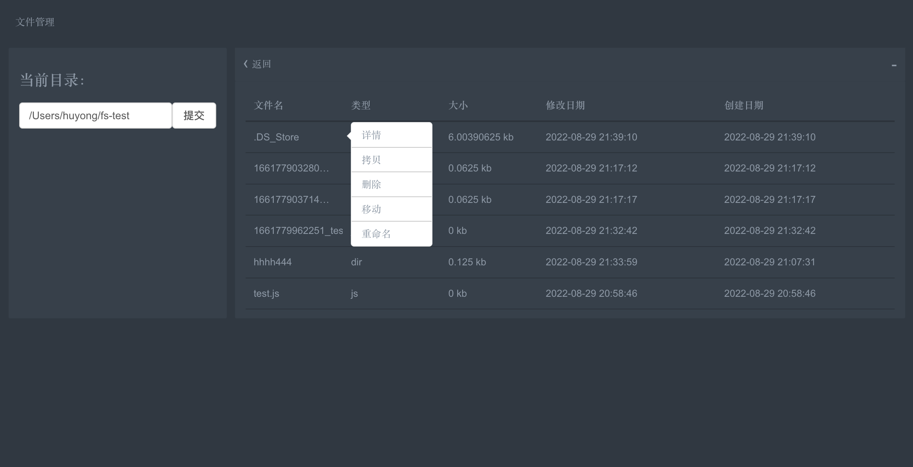
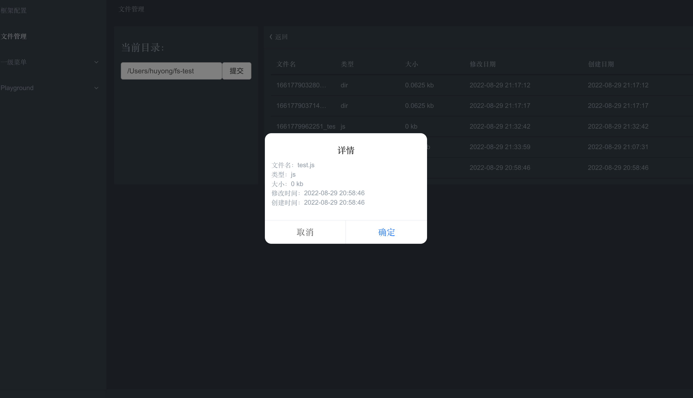
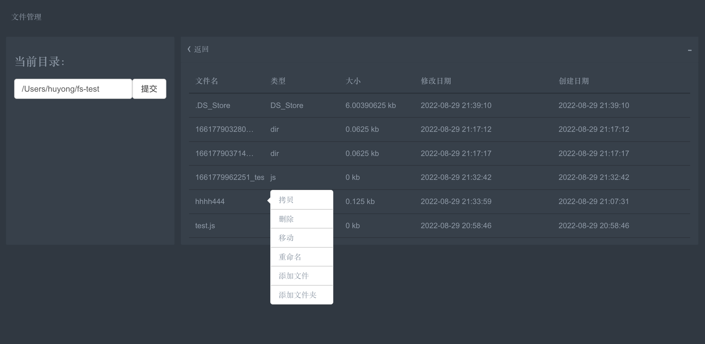
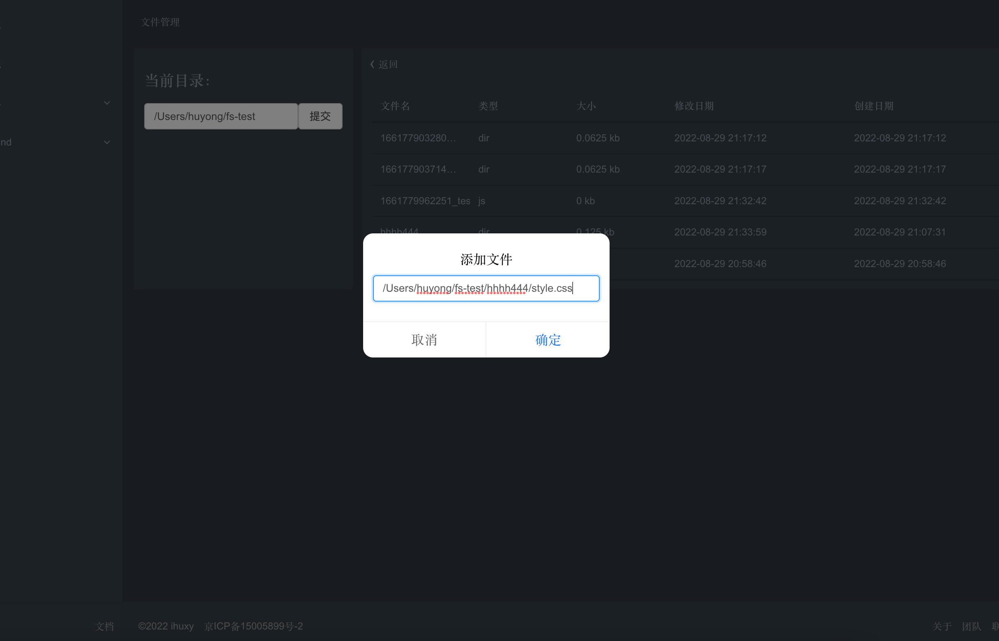
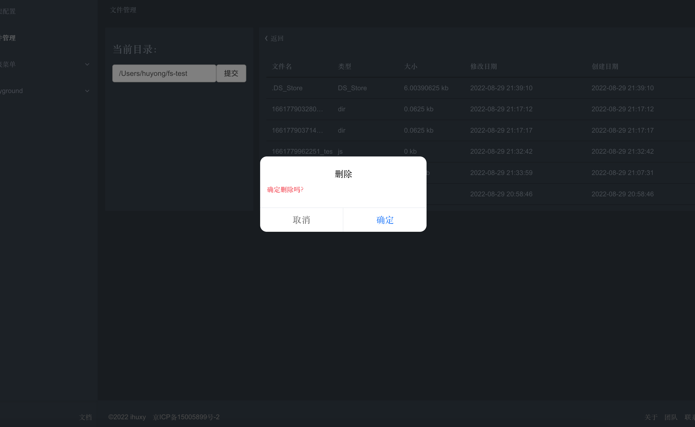
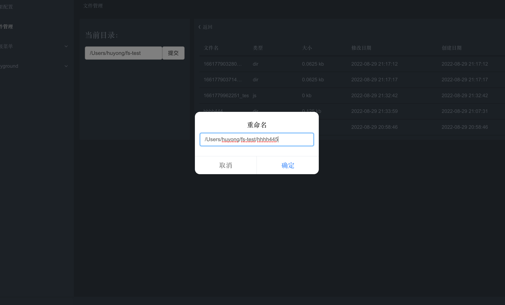
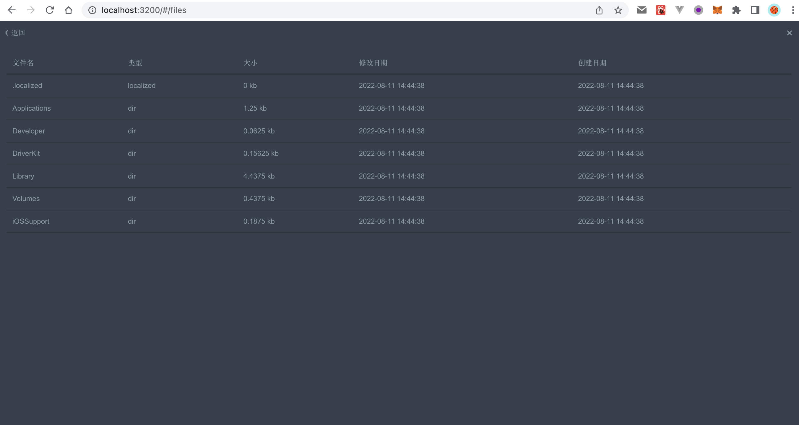

# 文件管理系统

## `fs` 模块简介

Node.js 提供一组可用于与文件系统进行交互（以类似于标准 POSIX 函数的方式）的模块 `fs` 。 使用方式：

```javascript
const fs = require('fs');

```

所有的文件系统操作都具有同步的、回调的、以及基于 promise 的形式。

### 示例

#### 同步

同步的形式会阻塞 Node.js 事件循环和进一步的 JavaScript 执行，直到操作完成。 异常会被立即地抛出，可以使用 try…catch 处理，也可以冒泡。

```javascript
const fs = require('fs');

try {
  fs.unlinkSync('文件');
  console.log('已成功删除文件');
} catch (err) {
  // 处理错误
}

```

#### 回调

异步的形式总是把完成回调作为其最后一个参数。 传给完成回调的参数取决于具体方法，但第一个参数总是预留给异常。 如果操作被成功地完成，则第一个参数会为 null 或 undefined。

```javascript
const fs = require('fs');

fs.unlink('文件', (err) => {
  if (err) throw err;
  console.log('已成功删除文件');
});

```

#### Promise

基于 promise 的操作会返回 Promise（当异步操作完成时被解决）。

```javascript
const fs = require('fs');

(async function(path) {
  try {
    await fs.unlink(path);
    console.log(`已成功删除 ${path}`);
  } catch (error) {
    console.error('出错：', error.message);
  }
})('文件');

```

## 文件管理系统


该示例是基于 `nodejs` 的一套UI可视化文件管理系统，提供一些常用文件（夹）操作，包含文件（夹） **_读取、创建、拷贝、移动、删除、重命名_**。

### 文件操作



#### 读取文件

可读取到文件大小、名称、类型、创建时间、修改时间等。



```javascript
const readfile = async (dir, filename) => {
  const fullname = fixpath(`${dir}/${filename}`);
  if (!fs.existsSync(fullname)) {
    throw Error(`[${fullname}] 文件或文件夹不存在!`);
  }
  const stats = await fs.statSync(fullname);
  if (stats.isFile()) {
    return {
      dir,
      filename,
      type: filename.split('.').slice(-1)[0],
      size: stats.size,
      mtime: stats.mtime,
      birthtime: stats.birthtime,
    };
  } else if (stats.isDirectory()) {
    return {
      dir,
      filename,
      type: 'dir',
      size: stats.size,
      mtime: stats.ctime,
      birthtime: stats.birthtime,
    };
  }
};

```

#### 读取文件夹



```javascript
const readdir = async dir => {
  dir = fixpath(dir);
  if (!fs.existsSync(dir)) {
    throw Error(`[${dir}] 文件夹不存在!`);
  }
  const files = await fs.readdirSync(dir);
  const result = [];
  for(let i = 0, l = files.length; i < l; i++) {
    try {
      const fileInfo = await readfile(dir, files[i]);
      result.push(fileInfo);
    } catch (err) {
      continue;
    }
  }
  return result;
};

```
#### 创建文件



```javascript
const touch = async (filename, override = true) => {
  filename = fixpath(filename);
  if (fs.existsSync(filename)) {
    if (!override) {
      throw Error(`[${filename}] 文件已存在!`);
    }
    await rmfile(filename);
  }
  await fs.writeFileSync(filename, '');
  return filename;
};

```
#### 创建文件夹


```javascript
const mkdir = async (dirname, override = true) => {
  dirname = fixpath(dirname);
  if (fs.existsSync(dirname)) {
    if (!override) {
      throw Error(`[${dirname}] 文件夹已存在!`);
    }
    await rmfile(dirname);
  }
  await fs.mkdirSync(dirname);
  return dirname;
};

```
#### 拷贝文件（夹）

```javascript
const copyfile = async (src, dst) => {
  src = fixpath(src);
  dst = fixpath(dst);
  if (!fs.existsSync(src)) {
    throw Error(`[${src}] 文件或文件夹不存在!`);
  }
  const stats = await fs.statSync(src);
  if (stats.isFile()) {
    const filename = src.split('/').slice(-1)[0];
    let dstfile = `${dst}/${filename}`;
    if (fs.existsSync(dstfile)) {
      dstfile = `${dst}/${+new Date()}_${filename}`;
    }
    await fs.copyFileSync(src, dstfile);
    return dstfile;
  }
  if (stats.isDirectory()) {
    const filename = src.split('/').slice(-1)[0];
    let dstfile = `${dst}/${filename}`;
    if (fs.existsSync(dstfile)) {
      dstfile = `${dst}/${+new Date()}_${filename}`;
    }
    await fs.mkdirSync(dstfile);
    const files = await fs.readdirSync(src);
    for(let i = 0, l = files.length; i < l; i++) {
      await copyfile(`${src}/${files[i]}`, dstfile);
    }
    return dstfile;
  }
};

```
#### 删除文件（夹）



```javascript
const rmfile = async path => {
  path = fixpath(path);
  if (!fs.existsSync(path)) {
    throw Error(`[${path}] 文件或文件夹不存在!`);
  }
  const stats = await fs.statSync(path);
  if (stats.isFile()) {
    await fs.unlinkSync(path);
    return path;
  }
  if (stats.isDirectory()) {
    const files = await fs.readdirSync(path);
    for(let i = 0, l = files.length; i < l; i++) {
      await rmfile(`${path}/${files[i]}`);
    }
    await fs.rmdirSync(path);
    return path;
  }
};

```
#### 移动文件（夹）


```javascript
const movefile = async (src, dst) => {
  await copyfile(src, dst);
  await rmfile(src);
};

```
#### 重命名文件（夹）



```javascript
const rnfile = async (path, newpath) => {
  newpath = fixpath(newpath);
  path = fixpath(path);
  if (!fs.existsSync(path)) {
    throw Error(`[${path}] 文件或文件夹不存在!`);
  }
  fs.renameSync(path, newpath);
};

```

### 服务接口

#### nodejs 服务端文件操作接口

```javascript
const startServer = app => {
  app.get('/fs/readdir', async (req, res) => {
    const {path} = req.query;
    try {
      const result = await readdir(path);
      res.status(200).send({result});
    } catch (error) {
      res.status(500).send({message: error.message});
    }
  });
  app.get('/fs/touch', async (req, res) => {
    const {path, override} = req.query;
    try {
      await touch(path, override);
      res.status(200).send({message: '操作成功！'});
    } catch (error) {
      res.status(500).send({error});
    }
  });
  app.get('/fs/rmfile', async (req, res) => {
    const {path} = req.query;
    try {
      await rmfile(path);
      res.status(200).send({message: '操作成功！'});
    } catch (error) {
      res.status(500).send({error});
    }
  });
  ...
};

```

#### 前端接口配置

```javascript
const apiList = projectId => [
  {
    name: 'readfile',
    url: '/readfile',
  },
  {
    name: 'readdir',
    url: '/readdir',
  },
  {
    name: 'mkdir',
    url: '/mkdir',
  },
  {
    name: 'touch',
    url: '/touch',
  },
  {
    name: 'copyfile',
    url: '/copyfile',
  },
  {
    name: 'movefile',
    url: '/movefile',
  },
  {
    name: 'rmfile',
    url: '/rmfile',
  },
  {
    name: 'rnfile',
    url: '/rnfile',
  },
];

```

### 功能函数

#### 窗口最大化



```html
<MaxSize panel={fileRef} target={document.body} />

```

#### 右键操作菜单

```html
<Drop trigger="contextMenu" dropList={fileDrop(filename)}>
  <div>{filename}</div>
</Drop>

```

#### 文件单位自动转换

```javascript
const fixFileSizeUnit = (size, base = 1024) => {
  const kb = size / base;
  if (kb < base) {
    return `${kb.toFixed(3) - 0} KB`;
  }
  const mb = kb / base;
  if (mb < base) {
    return `${mb.toFixed(3) - 0} M`;
  }
  const gb = mb / base;
  return `${gb.toFixed(3) - 0} G`;
};

```

